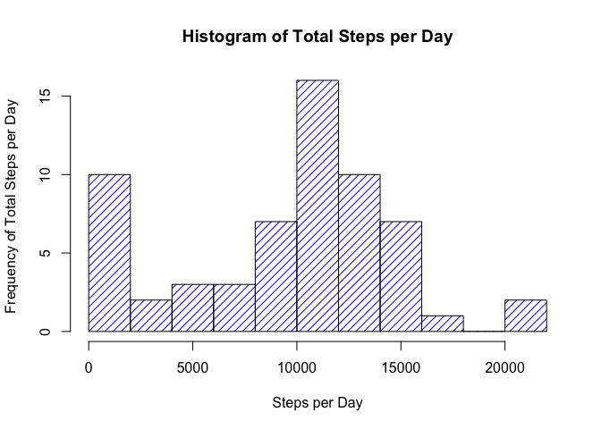
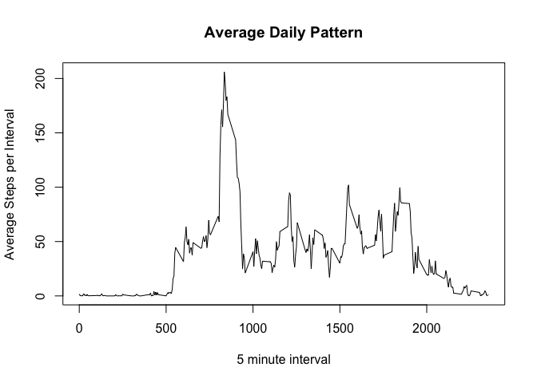
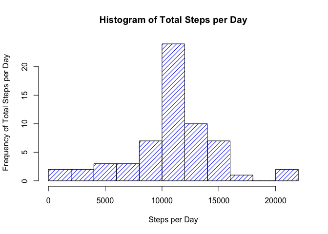

# Reproducible Research: Peer Assessment 1
Jose Buraschi  
March 15, 2015  


#Introduction#
It is now possible to collect a large amount of data about personal movement using activity monitoring devices such as a Fitbit, Nike Fuelband, or Jawbone Up. These type of devices are part of the “quantified self” movement – a group of enthusiasts who take measurements about themselves regularly to improve their health, to find patterns in their behavior, or because they are tech geeks. But these data remain under-utilized both because the raw data are hard to obtain and there is a lack of statistical methods and software for processing and interpreting the data.

This assignment makes use of data from a personal activity monitoring device. This device collects data at 5 minute intervals through out the day. The data consists of two months of data from an anonymous individual collected during the months of October and November, 2012 and include the number of steps taken in 5 minute intervals each day.

##Loading and preprocessing the data##
After cloning the repo or downloading the repo files and installing them in your machine, you will want to set the working directory in R or RStudio before running this scripts in this Mark Down file.  

###Set Working Directory###
Use the following code to set the working directory:


```r
scriptWorkingDirectory = "/Users/user1/RepData_PeerAssessment1"
scriptWorkingDirectory = "/Users/jaburaschi/DataScience/Coursera/DS-ReproducibleResearch/Project1/RepData_PeerAssessment1"

setwd(scriptWorkingDirectory)
```

###Loading Activity Monitor Data###
The personal activity monitoring device data is included in the root directory of this github repo. Note that the dataset is compressed as a zip file and can be read into R using the read.csv function as follows without first uncompressing the file:


```r
data <- read.csv(  unz("activity.zip", "activity.csv")
                 , nrows=17570
                 , stringsAsFactors=F
                 , colClasses=c("numeric", "Date", "numeric")
                 , col.names = c("steps","date_recorded","interval")
                 , header=F
                 , skip = 1
                 , na.strings = "NA"
                 , quote="\""
                 , blank.lines.skip = TRUE
                 , sep=",")
```

###Quick Look at the Contents###
Once the file has been loaded into R, it is helpful to examine the contents using the structure and summary functions.  Here are the results immediately below:


```r
str(data)
```

```
## 'data.frame':	17568 obs. of  3 variables:
##  $ steps        : num  NA NA NA NA NA NA NA NA NA NA ...
##  $ date_recorded: Date, format: "2012-10-01" "2012-10-01" ...
##  $ interval     : num  0 5 10 15 20 25 30 35 40 45 ...
```

```r
summary(data)
```

```
##      steps        date_recorded           interval     
##  Min.   :  0.00   Min.   :2012-10-01   Min.   :   0.0  
##  1st Qu.:  0.00   1st Qu.:2012-10-16   1st Qu.: 588.8  
##  Median :  0.00   Median :2012-10-31   Median :1177.5  
##  Mean   : 37.38   Mean   :2012-10-31   Mean   :1177.5  
##  3rd Qu.: 12.00   3rd Qu.:2012-11-15   3rd Qu.:1766.2  
##  Max.   :806.00   Max.   :2012-11-30   Max.   :2355.0  
##  NA's   :2304
```

##What is mean total number of steps taken per day?##
While calculating the mean total number of steps taken per day note that we are going to ignore missing values.  Below is the code to calculate the total number of steps taken per day and the contents of the resulting data frame.


```r
# Calculate Steps Taken Per Day and Assign Column Names to the Result
stepsPerDay <- aggregate(data$steps, by=list(data$date_recorded), FUN=sum, na.rm = TRUE)
colnames(stepsPerDay) <- c("date_recorded","total_steps")
stepsPerDay
```

```
##    date_recorded total_steps
## 1     2012-10-01           0
## 2     2012-10-02         126
## 3     2012-10-03       11352
## 4     2012-10-04       12116
## 5     2012-10-05       13294
## 6     2012-10-06       15420
## 7     2012-10-07       11015
## 8     2012-10-08           0
## 9     2012-10-09       12811
## 10    2012-10-10        9900
## 11    2012-10-11       10304
## 12    2012-10-12       17382
## 13    2012-10-13       12426
## 14    2012-10-14       15098
## 15    2012-10-15       10139
## 16    2012-10-16       15084
## 17    2012-10-17       13452
## 18    2012-10-18       10056
## 19    2012-10-19       11829
## 20    2012-10-20       10395
## 21    2012-10-21        8821
## 22    2012-10-22       13460
## 23    2012-10-23        8918
## 24    2012-10-24        8355
## 25    2012-10-25        2492
## 26    2012-10-26        6778
## 27    2012-10-27       10119
## 28    2012-10-28       11458
## 29    2012-10-29        5018
## 30    2012-10-30        9819
## 31    2012-10-31       15414
## 32    2012-11-01           0
## 33    2012-11-02       10600
## 34    2012-11-03       10571
## 35    2012-11-04           0
## 36    2012-11-05       10439
## 37    2012-11-06        8334
## 38    2012-11-07       12883
## 39    2012-11-08        3219
## 40    2012-11-09           0
## 41    2012-11-10           0
## 42    2012-11-11       12608
## 43    2012-11-12       10765
## 44    2012-11-13        7336
## 45    2012-11-14           0
## 46    2012-11-15          41
## 47    2012-11-16        5441
## 48    2012-11-17       14339
## 49    2012-11-18       15110
## 50    2012-11-19        8841
## 51    2012-11-20        4472
## 52    2012-11-21       12787
## 53    2012-11-22       20427
## 54    2012-11-23       21194
## 55    2012-11-24       14478
## 56    2012-11-25       11834
## 57    2012-11-26       11162
## 58    2012-11-27       13646
## 59    2012-11-28       10183
## 60    2012-11-29        7047
## 61    2012-11-30           0
```

###Histogram of Total Steps per Day###

```r
# Calculate Steps Taken Per Day and Assign Column Names to the Result
hist(  stepsPerDay$total_steps
     , main="Histogram of Total Steps per Day"
     , xlab = "Steps per Day"
     , ylab = "Frequency of Total Steps per Day"
     , col = "Blue"
     , density = 15
     , border = "Black"
     , breaks = 10)
```

 

###Mean Steps Taken per Day###
The mean steps taken per day is calculated immediately below:

```r
mean(stepsPerDay$total_steps)
```

```
## [1] 9354.23
```

###Median Steps Taken per Day###
The median steps taken per day is calculated immediately below:

```r
median(stepsPerDay$total_steps)
```

```
## [1] 10395
```


##What is the average daily activity pattern?##
A plot of the average steps taken by daily time interval can help explore the daily activity patterns. 


```r
meanStepsPerInterval <- aggregate(data$steps, by=list(data$interval), FUN=mean, na.rm = TRUE)
colnames(meanStepsPerInterval) <- c("interval","average_steps")
plot(   x=meanStepsPerInterval$interval
     , y=meanStepsPerInterval$average_steps,type="l"
     , xlab = "5 minute interval"
     , ylab = "Average Steps per Interval"
     , main = "Average Daily Pattern"
     )
```

 

###Max Number of Steps Interval###
Which 5-minute interval, on average across all the days in the dataset, contains the maximum number of steps?

The following calculations provide the interval and maximum average number of steps

```r
maxIntervalRow = meanStepsPerInterval[ meanStepsPerInterval$average_steps==max(meanStepsPerInterval$average_steps),]
```

The 5 minute interval with the maximum number of average steps taken per day is listed immediately below:

```r
maxIntervalRow$interval
```

```
## [1] 835
```

The maximum number of average steps taken per day is listed immediately below:

```r
maxIntervalRow$average_steps
```

```
## [1] 206.1698
```

##Imputing missing values##

Calculate and report the total number of missing values in the dataset (i.e. the total number of rows with NAs)

The number of rows with NA value for the number of steps taken in that time interval is provided immediately below:

```r
sum(is.na(data$steps))
```

```
## [1] 2304
```

###Replace Missing Values###
To replace the missing values we will leverage the average steps taken per day interval from the previous problem and we will update the NA values with these averages matching the data by interval immediately below:

```r
#Calculate mean steps per day by interval
dataNoNAs <- data[!is.na(data$steps),]

dataNAVals <- merge(x = data[is.na(data$steps),],y = meanStepsPerInterval, by="interval",all.x = TRUE)
dataNAVals = dataNAVals[,c("average_steps","date_recorded","interval")]
colnames(dataNAVals) = c("steps","date_recorded","interval")

#Create a new data set replacing NAs with the mean of the non-NA intervals
dataNew = rbind(dataNoNAs, dataNAVals)
str(dataNew)
```

```
## 'data.frame':	17568 obs. of  3 variables:
##  $ steps        : num  0 0 0 0 0 0 0 0 0 0 ...
##  $ date_recorded: Date, format: "2012-10-02" "2012-10-02" ...
##  $ interval     : num  0 5 10 15 20 25 30 35 40 45 ...
```

Make a histogram of the total number of steps taken each day and Calculate and report the mean and median total number of steps taken per day. 


```r
# Calculate Steps Taken Per Day and Assign Column Names to the Result
stepsPerDay <- aggregate(dataNew$steps, by=list(dataNew$date_recorded), FUN=sum, na.rm = TRUE)
colnames(stepsPerDay) <- c("date_recorded","total_steps")
stepsPerDay
```

```
##    date_recorded total_steps
## 1     2012-10-01    10766.19
## 2     2012-10-02      126.00
## 3     2012-10-03    11352.00
## 4     2012-10-04    12116.00
## 5     2012-10-05    13294.00
## 6     2012-10-06    15420.00
## 7     2012-10-07    11015.00
## 8     2012-10-08    10766.19
## 9     2012-10-09    12811.00
## 10    2012-10-10     9900.00
## 11    2012-10-11    10304.00
## 12    2012-10-12    17382.00
## 13    2012-10-13    12426.00
## 14    2012-10-14    15098.00
## 15    2012-10-15    10139.00
## 16    2012-10-16    15084.00
## 17    2012-10-17    13452.00
## 18    2012-10-18    10056.00
## 19    2012-10-19    11829.00
## 20    2012-10-20    10395.00
## 21    2012-10-21     8821.00
## 22    2012-10-22    13460.00
## 23    2012-10-23     8918.00
## 24    2012-10-24     8355.00
## 25    2012-10-25     2492.00
## 26    2012-10-26     6778.00
## 27    2012-10-27    10119.00
## 28    2012-10-28    11458.00
## 29    2012-10-29     5018.00
## 30    2012-10-30     9819.00
## 31    2012-10-31    15414.00
## 32    2012-11-01    10766.19
## 33    2012-11-02    10600.00
## 34    2012-11-03    10571.00
## 35    2012-11-04    10766.19
## 36    2012-11-05    10439.00
## 37    2012-11-06     8334.00
## 38    2012-11-07    12883.00
## 39    2012-11-08     3219.00
## 40    2012-11-09    10766.19
## 41    2012-11-10    10766.19
## 42    2012-11-11    12608.00
## 43    2012-11-12    10765.00
## 44    2012-11-13     7336.00
## 45    2012-11-14    10766.19
## 46    2012-11-15       41.00
## 47    2012-11-16     5441.00
## 48    2012-11-17    14339.00
## 49    2012-11-18    15110.00
## 50    2012-11-19     8841.00
## 51    2012-11-20     4472.00
## 52    2012-11-21    12787.00
## 53    2012-11-22    20427.00
## 54    2012-11-23    21194.00
## 55    2012-11-24    14478.00
## 56    2012-11-25    11834.00
## 57    2012-11-26    11162.00
## 58    2012-11-27    13646.00
## 59    2012-11-28    10183.00
## 60    2012-11-29     7047.00
## 61    2012-11-30    10766.19
```

###Histogram of Total Steps per Day###

```r
# Calculate Steps Taken Per Day and Assign Column Names to the Result
hist(  stepsPerDay$total_steps
     , main="Histogram of Total Steps per Day"
     , xlab = "Steps per Day"
     , ylab = "Frequency of Total Steps per Day"
     , col = "Blue"
     , density = 15
     , border = "Black"
     , breaks = 10)
```

 

###Do these values differ from the estimates from the first part of the assignment? ###
Yes, the values differ from the estimates in the first part of the assignments where the rows with NA values were ignored.

###What is the impact of imputing missing data on the estimates of the total daily number of steps?###
The frequency of days with more stays has increased and now the distribution looks more gaussian.

###Mean Steps Taken per Day###
The mean steps taken per day is calculated immediately below:

```r
mean(stepsPerDay$total_steps)
```

```
## [1] 10766.19
```

###Median Steps Taken per Day###
The median steps taken per day is calculated immediately below:

```r
median(stepsPerDay$total_steps)
```

```
## [1] 10766.19
```

## Are there differences in activity patterns between weekdays and weekends?

Create a new factor variable in the dataset with two levels – “weekday” and “weekend” indicating whether a given date is a weekday or weekend day.

```r
dataNew$day_of_week <- weekdays(dataNew$date_recorded)
dataNew$day_type <- ifelse(dataNew$day_of_week == "Saturday" | dataNew$day_of_week =="Sunday","Weekend", "Weekday")
```

Calculate Average by dayType and Interval

```r
# Calculate Steps Taken Per Day and Assign Column Names to the Result
stepsPerDay <- aggregate(dataNew$steps, by=list(dataNew$day_type, dataNew$interval), FUN=mean, na.rm = TRUE)
colnames(stepsPerDay) <- c("day_type","interval", "average_steps")
stepsPerDay
```

```
##     day_type interval average_steps
## 1    Weekday        0  2.251153e+00
## 2    Weekend        0  2.146226e-01
## 3    Weekday        5  4.452830e-01
## 4    Weekend        5  4.245283e-02
## 5    Weekday       10  1.731656e-01
## 6    Weekend       10  1.650943e-02
## 7    Weekday       15  1.979036e-01
## 8    Weekend       15  1.886792e-02
## 9    Weekday       20  9.895178e-02
## 10   Weekend       20  9.433962e-03
## 11   Weekday       25  1.590356e+00
## 12   Weekend       25  3.511792e+00
## 13   Weekday       30  6.926625e-01
## 14   Weekend       30  6.603774e-02
## 15   Weekday       35  1.137945e+00
## 16   Weekend       35  1.084906e-01
## 17   Weekday       40  0.000000e+00
## 18   Weekend       40  0.000000e+00
## 19   Weekday       45  1.796226e+00
## 20   Weekend       45  5.589623e-01
## 21   Weekday       50  3.958071e-01
## 22   Weekend       50  3.773585e-02
## 23   Weekday       55  1.761006e-02
## 24   Weekend       55  4.540094e-01
## 25   Weekday      100  4.205451e-01
## 26   Weekend      100  4.009434e-02
## 27   Weekday      105  9.056604e-02
## 28   Weekend      105  2.334906e+00
## 29   Weekday      110  1.979036e-01
## 30   Weekend      110  1.886792e-02
## 31   Weekday      115  4.452830e-01
## 32   Weekend      115  4.245283e-02
## 33   Weekday      120  0.000000e+00
## 34   Weekend      120  0.000000e+00
## 35   Weekday      125  1.459539e+00
## 36   Weekend      125  1.391509e-01
## 37   Weekday      130  2.221803e+00
## 38   Weekend      130  7.287736e-01
## 39   Weekday      135  2.264151e-02
## 40   Weekend      135  5.837264e-01
## 41   Weekday      140  2.226415e-01
## 42   Weekend      140  2.122642e-02
## 43   Weekday      145  2.503145e-01
## 44   Weekend      145  7.346698e-01
## 45   Weekday      150  3.463312e-01
## 46   Weekend      150  3.301887e-02
## 47   Weekday      155  0.000000e+00
## 48   Weekend      155  0.000000e+00
## 49   Weekday      200  0.000000e+00
## 50   Weekend      200  0.000000e+00
## 51   Weekday      205  0.000000e+00
## 52   Weekend      205  0.000000e+00
## 53   Weekday      210  1.395388e+00
## 54   Weekend      210  3.915094e-01
## 55   Weekday      215  0.000000e+00
## 56   Weekend      215  0.000000e+00
## 57   Weekday      220  0.000000e+00
## 58   Weekend      220  0.000000e+00
## 59   Weekday      225  1.731656e-01
## 60   Weekend      225  1.650943e-02
## 61   Weekday      230  0.000000e+00
## 62   Weekend      230  0.000000e+00
## 63   Weekday      235  2.968553e-01
## 64   Weekend      235  2.830189e-02
## 65   Weekday      240  0.000000e+00
## 66   Weekend      240  0.000000e+00
## 67   Weekday      245  0.000000e+00
## 68   Weekend      245  0.000000e+00
## 69   Weekday      250  2.028512e+00
## 70   Weekend      250  1.933962e-01
## 71   Weekday      255  1.236897e+00
## 72   Weekend      255  1.179245e-01
## 73   Weekday      300  0.000000e+00
## 74   Weekend      300  0.000000e+00
## 75   Weekday      305  0.000000e+00
## 76   Weekend      305  0.000000e+00
## 77   Weekday      310  0.000000e+00
## 78   Weekend      310  0.000000e+00
## 79   Weekday      315  0.000000e+00
## 80   Weekend      315  0.000000e+00
## 81   Weekday      320  2.767296e-02
## 82   Weekend      320  7.134434e-01
## 83   Weekday      325  8.163522e-01
## 84   Weekend      325  7.783019e-02
## 85   Weekday      330  1.238574e+00
## 86   Weekend      330  2.702830e+00
## 87   Weekday      335  5.224319e-01
## 88   Weekend      335  7.606132e-01
## 89   Weekday      340  4.209644e-01
## 90   Weekend      340  6.863208e-01
## 91   Weekday      345  9.895178e-02
## 92   Weekend      345  9.433962e-03
## 93   Weekday      350  0.000000e+00
## 94   Weekend      350  0.000000e+00
## 95   Weekday      355  0.000000e+00
## 96   Weekend      355  0.000000e+00
## 97   Weekday      400  2.696017e-01
## 98   Weekend      400  3.773585e+00
## 99   Weekday      405  1.236897e+00
## 100  Weekend      405  1.179245e-01
## 101  Weekday      410  2.231027e+00
## 102  Weekend      410  3.508255e+00
## 103  Weekday      415  0.000000e+00
## 104  Weekend      415  0.000000e+00
## 105  Weekday      420  4.452830e-01
## 106  Weekend      420  4.245283e-02
## 107  Weekday      425  4.779874e-02
## 108  Weekend      425  1.232311e+00
## 109  Weekday      430  3.370650e+00
## 110  Weekend      430  6.201651e+00
## 111  Weekday      435  2.213836e-01
## 112  Weekend      435  1.895047e+00
## 113  Weekday      440  3.776520e+00
## 114  Weekend      440  2.686321e+00
## 115  Weekday      445  8.884696e-01
## 116  Weekend      445  6.662736e-01
## 117  Weekday      450  2.348428e+00
## 118  Weekend      450  5.264151e+00
## 119  Weekday      455  7.262055e-01
## 120  Weekend      455  2.201651e+00
## 121  Weekday      500  0.000000e+00
## 122  Weekend      500  0.000000e+00
## 123  Weekday      505  2.053249e+00
## 124  Weekend      505  1.957547e-01
## 125  Weekday      510  3.933333e+00
## 126  Weekend      510  3.750000e-01
## 127  Weekday      515  2.188260e+00
## 128  Weekend      515  2.405660e+00
## 129  Weekday      520  4.220545e+00
## 130  Weekend      520  7.900943e-01
## 131  Weekday      525  2.706080e+00
## 132  Weekend      525  3.682783e+00
## 133  Weekday      530  2.745912e+00
## 134  Weekend      530  2.617925e-01
## 135  Weekday      535  7.940881e+00
## 136  Weekend      535  7.570755e-01
## 137  Weekday      540  2.040252e+01
## 138  Weekend      540  3.689858e+00
## 139  Weekday      545  2.364528e+01
## 140  Weekend      545  3.417453e+00
## 141  Weekday      550  5.034927e+01
## 142  Weekend      550  8.806604e+00
## 143  Weekday      555  5.626541e+01
## 144  Weekend      555  1.137382e+01
## 145  Weekday      600  4.128763e+01
## 146  Weekend      600  3.936321e+00
## 147  Weekday      605  6.459078e+01
## 148  Weekend      605  6.158019e+00
## 149  Weekday      610  7.008092e+01
## 150  Weekend      610  7.909198e+00
## 151  Weekday      615  7.714927e+01
## 152  Weekend      615  2.493160e+01
## 153  Weekday      620  6.392830e+01
## 154  Weekend      620  1.068278e+01
## 155  Weekday      625  6.003229e+01
## 156  Weekend      625  1.063443e+01
## 157  Weekday      630  6.644235e+01
## 158  Weekend      630  1.195637e+01
## 159  Weekday      635  4.797862e+01
## 160  Weekend      635  1.504245e+01
## 161  Weekday      640  5.566918e+01
## 162  Weekend      640  1.125236e+01
## 163  Weekday      645  5.486709e+01
## 164  Weekend      645  1.408373e+01
## 165  Weekday      650  4.704780e+01
## 166  Weekend      650  1.010731e+01
## 167  Weekday      655  6.042725e+01
## 168  Weekend      655  1.700472e+01
## 169  Weekday      700  5.059706e+01
## 170  Weekend      700  2.472642e+01
## 171  Weekday      705  5.082809e+01
## 172  Weekend      705  2.623467e+01
## 173  Weekday      710  6.202348e+01
## 174  Weekend      710  1.812618e+01
## 175  Weekday      715  6.933459e+01
## 176  Weekend      715  1.281368e+01
## 177  Weekday      720  6.310105e+01
## 178  Weekend      720  1.286557e+01
## 179  Weekday      725  5.910860e+01
## 180  Weekend      725  2.812264e+01
## 181  Weekday      730  6.622390e+01
## 182  Weekend      730  2.602241e+01
## 183  Weekday      735  5.435388e+01
## 184  Weekend      735  1.610259e+01
## 185  Weekday      740  6.272411e+01
## 186  Weekend      740  2.284552e+01
## 187  Weekday      745  8.338407e+01
## 188  Weekend      745  3.063090e+01
## 189  Weekday      750  6.773543e+01
## 190  Weekend      750  3.004363e+01
## 191  Weekday      755  6.657568e+01
## 192  Weekend      755  2.683137e+01
## 193  Weekday      800  8.271698e+01
## 194  Weekend      800  4.710967e+01
## 195  Weekday      805  7.196101e+01
## 196  Weekend      805  5.765094e+01
## 197  Weekday      810  1.440134e+02
## 198  Weekend      810  8.842925e+01
## 199  Weekday      815  1.819816e+02
## 200  Weekend      815  8.875354e+01
## 201  Weekday      820  2.005757e+02
## 202  Weekend      820  8.839387e+01
## 203  Weekday      825  1.836084e+02
## 204  Weekend      825  7.604953e+01
## 205  Weekday      830  1.988847e+02
## 206  Weekend      830  1.166002e+02
## 207  Weekday      835  2.303782e+02
## 208  Weekend      835  1.380837e+02
## 209  Weekday      840  2.189010e+02
## 210  Weekend      840  1.313031e+02
## 211  Weekday      845  1.856532e+02
## 212  Weekend      845  1.624458e+02
## 213  Weekday      850  1.912306e+02
## 214  Weekend      850  1.613620e+02
## 215  Weekday      855  1.770914e+02
## 216  Weekend      855  1.386899e+02
## 217  Weekday      900  1.676604e+02
## 218  Weekend      900  7.536910e+01
## 219  Weekday      905  1.257828e+02
## 220  Weekend      905  1.191297e+02
## 221  Weekday      910  9.394843e+01
## 222  Weekend      910  1.517642e+02
## 223  Weekday      915  8.730398e+01
## 224  Weekend      915  1.666392e+02
## 225  Weekday      920  1.035400e+02
## 226  Weekend      920  1.042146e+02
## 227  Weekday      925  9.246164e+01
## 228  Weekend      925  1.058078e+02
## 229  Weekday      930  5.851656e+01
## 230  Weekend      930  8.783844e+01
## 231  Weekday      935  3.585241e+01
## 232  Weekend      935  7.159080e+01
## 233  Weekday      940  2.746122e+01
## 234  Weekend      940  1.728656e+01
## 235  Weekday      945  4.085618e+01
## 236  Weekend      945  3.284434e+01
## 237  Weekday      950  3.913082e+01
## 238  Weekend      950  2.331014e+01
## 239  Weekday      955  1.762977e+01
## 240  Weekend      955  3.069458e+01
## 241  Weekday     1000  3.787547e+01
## 242  Weekend     1000  4.813325e+01
## 243  Weekday     1005  1.821971e+01
## 244  Weekend     1005  5.162264e+01
## 245  Weekday     1010  3.907757e+01
## 246  Weekend     1010  5.180189e+01
## 247  Weekday     1015  4.782138e+01
## 248  Weekend     1015  6.627005e+01
## 249  Weekday     1020  3.034549e+01
## 250  Weekend     1020  6.305307e+01
## 251  Weekday     1025  3.515010e+01
## 252  Weekend     1025  9.478656e+01
## 253  Weekday     1030  3.312662e+01
## 254  Weekend     1030  7.566038e+01
## 255  Weekday     1035  2.425535e+01
## 256  Weekend     1035  7.442689e+01
## 257  Weekday     1040  2.351530e+01
## 258  Weekend     1040  6.614976e+01
## 259  Weekday     1045  2.591195e+01
## 260  Weekend     1045  3.516745e+01
## 261  Weekday     1050  2.203480e+01
## 262  Weekend     1050  3.369929e+01
## 263  Weekday     1055  2.325912e+01
## 264  Weekend     1055  5.636792e+01
## 265  Weekday     1100  2.169224e+01
## 266  Weekend     1100  5.854481e+01
## 267  Weekday     1105  2.509057e+01
## 268  Weekend     1105  4.258491e+01
## 269  Weekday     1110  1.168721e+01
## 270  Weekend     1110  4.841509e+01
## 271  Weekday     1115  1.627296e+01
## 272  Weekend     1115  5.163090e+01
## 273  Weekday     1120  2.418365e+01
## 274  Weekend     1120  4.017217e+01
## 275  Weekday     1125  2.372956e+01
## 276  Weekend     1125  3.418396e+01
## 277  Weekday     1130  3.276897e+01
## 278  Weekend     1130  3.530425e+01
## 279  Weekday     1135  5.019748e+01
## 280  Weekend     1135  4.937264e+01
## 281  Weekday     1140  4.456059e+01
## 282  Weekend     1140  3.494222e+01
## 283  Weekday     1145  4.792495e+01
## 284  Weekend     1145  3.526297e+01
## 285  Weekday     1150  5.011614e+01
## 286  Weekend     1150  3.456722e+01
## 287  Weekday     1155  5.613627e+01
## 288  Weekend     1155  6.777358e+01
## 289  Weekday     1200  5.571572e+01
## 290  Weekend     1200  8.679599e+01
## 291  Weekday     1205  7.284864e+01
## 292  Weekend     1205  1.294623e+02
## 293  Weekday     1210  8.364654e+01
## 294  Weekend     1210  1.263561e+02
## 295  Weekday     1215  7.528092e+01
## 296  Weekend     1215  1.419717e+02
## 297  Weekday     1220  4.871950e+01
## 298  Weekend     1220  1.046745e+02
## 299  Weekday     1225  4.682264e+01
## 300  Weekend     1225  5.958373e+01
## 301  Weekday     1230  6.257400e+01
## 302  Weekend     1230  3.168396e+01
## 303  Weekday     1235  3.074423e+01
## 304  Weekend     1235  3.711439e+01
## 305  Weekday     1240  2.198155e+01
## 306  Weekend     1240  3.931604e+01
## 307  Weekday     1245  2.932034e+01
## 308  Weekend     1245  6.140448e+01
## 309  Weekday     1250  3.278532e+01
## 310  Weekend     1250  7.956958e+01
## 311  Weekday     1255  5.659329e+01
## 312  Weekend     1255  9.734788e+01
## 313  Weekday     1300  2.460084e+01
## 314  Weekend     1300  9.222995e+01
## 315  Weekday     1305  2.574046e+01
## 316  Weekend     1305  7.967335e+01
## 317  Weekday     1310  2.456855e+01
## 318  Weekend     1310  9.584552e+01
## 319  Weekday     1315  1.564193e+01
## 320  Weekend     1315  1.122476e+02
## 321  Weekday     1320  3.563270e+01
## 322  Weekend     1320  7.609316e+01
## 323  Weekday     1325  4.485786e+01
## 324  Weekend     1325  8.899175e+01
## 325  Weekday     1330  3.176730e+01
## 326  Weekend     1330  7.365684e+01
## 327  Weekday     1335  2.330650e+01
## 328  Weekend     1335  3.026651e+01
## 329  Weekday     1340  2.523941e+01
## 330  Weekend     1340  8.137028e+01
## 331  Weekday     1345  4.018407e+01
## 332  Weekend     1345  9.113090e+01
## 333  Weekday     1350  2.557610e+01
## 334  Weekend     1350  1.084776e+02
## 335  Weekday     1355  3.633040e+01
## 336  Weekend     1355  1.296639e+02
## 337  Weekday     1400  4.692285e+01
## 338  Weekend     1400  8.059434e+01
## 339  Weekday     1405  3.955052e+01
## 340  Weekend     1405  8.687028e+01
## 341  Weekday     1410  3.212243e+01
## 342  Weekend     1410  7.582311e+01
## 343  Weekday     1415  4.504864e+01
## 344  Weekend     1415  5.896226e+01
## 345  Weekday     1420  2.748512e+01
## 346  Weekend     1420  5.793396e+01
## 347  Weekday     1425  3.076184e+01
## 348  Weekend     1425  5.663090e+01
## 349  Weekday     1430  3.149099e+01
## 350  Weekend     1430  7.098113e+01
## 351  Weekday     1435  1.451237e+01
## 352  Weekend     1435  6.406368e+01
## 353  Weekday     1440  1.154843e+01
## 354  Weekend     1440  3.276415e+01
## 355  Weekday     1445  2.198784e+01
## 356  Weekend     1445  3.757193e+01
## 357  Weekday     1450  4.186080e+01
## 358  Weekend     1450  4.857783e+01
## 359  Weekday     1455  3.828092e+01
## 360  Weekend     1455  5.922170e+01
## 361  Weekday     1500  3.086918e+01
## 362  Weekend     1500  2.762736e+01
## 363  Weekday     1505  3.505451e+01
## 364  Weekend     1505  3.894693e+01
## 365  Weekday     1510  2.995430e+01
## 366  Weekend     1510  5.106132e+01
## 367  Weekday     1515  3.191321e+01
## 368  Weekend     1515  5.835613e+01
## 369  Weekday     1520  3.986164e+01
## 370  Weekend     1520  6.312028e+01
## 371  Weekday     1525  3.734507e+01
## 372  Weekend     1525  7.703184e+01
## 373  Weekday     1530  4.212872e+01
## 374  Weekend     1530  6.501651e+01
## 375  Weekday     1535  5.093166e+01
## 376  Weekend     1535  1.057901e+02
## 377  Weekday     1540  9.056520e+01
## 378  Weekend     1540  6.136321e+01
## 379  Weekday     1545  9.586583e+01
## 380  Weekend     1545  1.065200e+02
## 381  Weekday     1550  9.394843e+01
## 382  Weekend     1550  1.250767e+02
## 383  Weekday     1555  7.030608e+01
## 384  Weekend     1555  1.223703e+02
## 385  Weekday     1600  4.688428e+01
## 386  Weekend     1600  1.050165e+02
## 387  Weekday     1605  4.519539e+01
## 388  Weekend     1605  1.173915e+02
## 389  Weekday     1610  5.660629e+01
## 390  Weekend     1610  1.250059e+02
## 391  Weekday     1615  3.613375e+01
## 392  Weekend     1615  1.392087e+02
## 393  Weekday     1620  2.680964e+01
## 394  Weekend     1620  1.415507e+02
## 395  Weekday     1625  2.952537e+01
## 396  Weekend     1625  1.448467e+02
## 397  Weekday     1630  2.251572e+01
## 398  Weekend     1630  1.039210e+02
## 399  Weekday     1635  2.183103e+01
## 400  Weekend     1635  8.563325e+01
## 401  Weekday     1640  2.586583e+01
## 402  Weekend     1640  9.752005e+01
## 403  Weekday     1645  3.199371e+01
## 404  Weekend     1645  8.330660e+01
## 405  Weekday     1650  2.762767e+01
## 406  Weekend     1650  9.846344e+01
## 407  Weekday     1655  3.242390e+01
## 408  Weekend     1655  7.533491e+01
## 409  Weekday     1700  2.357191e+01
## 410  Weekend     1700  1.114528e+02
## 411  Weekday     1705  4.495136e+01
## 412  Weekend     1705  8.822524e+01
## 413  Weekday     1710  3.418449e+01
## 414  Weekend     1710  9.721462e+01
## 415  Weekday     1715  4.807463e+01
## 416  Weekend     1715  9.821580e+01
## 417  Weekday     1720  6.011782e+01
## 418  Weekend     1720  1.081521e+02
## 419  Weekday     1725  7.237023e+01
## 420  Weekend     1725  9.743042e+01
## 421  Weekday     1730  5.614801e+01
## 422  Weekend     1730  1.049304e+02
## 423  Weekday     1735  6.582138e+01
## 424  Weekend     1735  4.233255e+01
## 425  Weekday     1740  8.287925e+01
## 426  Weekend     1740  5.319929e+01
## 427  Weekday     1745  5.933459e+01
## 428  Weekend     1745  4.856368e+01
## 429  Weekday     1750  3.450314e+01
## 430  Weekend     1750  3.553420e+01
## 431  Weekday     1755  3.759371e+01
## 432  Weekend     1755  3.705660e+01
## 433  Weekday     1800  2.664612e+01
## 434  Weekend     1800  8.014741e+01
## 435  Weekday     1805  4.662474e+01
## 436  Weekend     1805  9.006486e+01
## 437  Weekday     1810  6.722642e+01
## 438  Weekend     1810  9.571226e+01
## 439  Weekday     1815  8.264277e+01
## 440  Weekend     1815  9.285259e+01
## 441  Weekday     1820  6.139078e+01
## 442  Weekend     1820  5.328302e+01
## 443  Weekday     1825  7.345870e+01
## 444  Weekend     1825  5.178420e+01
## 445  Weekday     1830  7.922642e+01
## 446  Weekend     1830  7.339976e+01
## 447  Weekday     1835  8.149937e+01
## 448  Weekend     1835  5.384316e+01
## 449  Weekday     1840  9.171195e+01
## 450  Weekend     1840  6.741745e+01
## 451  Weekday     1845  1.154604e+02
## 452  Weekend     1845  5.443160e+01
## 453  Weekday     1850  1.013002e+02
## 454  Weekend     1850  4.519811e+01
## 455  Weekday     1855  9.059161e+01
## 456  Weekend     1855  7.157547e+01
## 457  Weekday     1900  8.756017e+01
## 458  Weekend     1900  7.729599e+01
## 459  Weekday     1905  7.722180e+01
## 460  Weekend     1905  7.954127e+01
## 461  Weekday     1910  6.238281e+01
## 462  Weekend     1910  4.581722e+01
## 463  Weekday     1915  5.438113e+01
## 464  Weekend     1915  5.048231e+01
## 465  Weekday     1920  3.788721e+01
## 466  Weekend     1920  3.191509e+01
## 467  Weekday     1925  2.056226e+01
## 468  Weekend     1925  2.115212e+01
## 469  Weekday     1930  2.909727e+01
## 470  Weekend     1930  2.261203e+01
## 471  Weekday     1935  4.598029e+01
## 472  Weekend     1935  2.325236e+01
## 473  Weekday     1940  3.004990e+01
## 474  Weekend     1940  3.065094e+01
## 475  Weekday     1945  1.858407e+01
## 476  Weekend     1945  4.513090e+01
## 477  Weekday     1950  4.426583e+01
## 478  Weekend     1950  4.958255e+01
## 479  Weekday     1955  2.729266e+01
## 480  Weekend     1955  5.106604e+01
## 481  Weekday     2000  1.339413e+01
## 482  Weekend     2000  3.714033e+01
## 483  Weekday     2005  5.558071e+00
## 484  Weekend     2005  5.687736e+01
## 485  Weekday     2010  6.823061e+00
## 486  Weekend     2010  5.454245e+01
## 487  Weekday     2015  1.411195e+01
## 488  Weekend     2015  8.741745e+01
## 489  Weekday     2020  8.708176e+00
## 490  Weekend     2020  7.772642e+01
## 491  Weekday     2025  5.711530e+00
## 492  Weekend     2025  6.464623e+01
## 493  Weekday     2030  9.773585e+00
## 494  Weekend     2030  7.660024e+01
## 495  Weekday     2035  7.156394e+00
## 496  Weekend     2035  6.122995e+01
## 497  Weekday     2040  8.961845e+00
## 498  Weekend     2040  4.931840e+01
## 499  Weekday     2045  1.310943e+01
## 500  Weekend     2045  4.441509e+01
## 501  Weekday     2050  2.597358e+01
## 502  Weekend     2050  5.010024e+01
## 503  Weekday     2055  1.730901e+01
## 504  Weekend     2055  2.814387e+01
## 505  Weekday     2100  1.137023e+01
## 506  Weekend     2100  2.880542e+01
## 507  Weekday     2105  1.889686e+01
## 508  Weekend     2105  1.252830e+01
## 509  Weekday     2110  2.850482e+01
## 510  Weekend     2110  9.244104e+00
## 511  Weekday     2115  1.894382e+01
## 512  Weekend     2115  2.009316e+01
## 513  Weekday     2120  1.428260e+01
## 514  Weekend     2120  7.306604e+00
## 515  Weekday     2125  8.046960e+00
## 516  Weekend     2125  7.939858e+00
## 517  Weekday     2130  1.279916e+01
## 518  Weekend     2130  1.989505e+01
## 519  Weekday     2135  1.650692e+01
## 520  Weekend     2135  1.572524e+01
## 521  Weekday     2140  7.135010e+00
## 522  Weekend     2140  1.302241e+01
## 523  Weekday     2145  7.594549e+00
## 524  Weekend     2145  8.349057e+00
## 525  Weekday     2150  8.262055e+00
## 526  Weekend     2150  7.766509e+00
## 527  Weekday     2155  3.438574e+00
## 528  Weekend     2155  3.278302e-01
## 529  Weekday     2200  1.527044e+00
## 530  Weekend     2200  1.244104e+00
## 531  Weekday     2205  4.423899e+00
## 532  Weekend     2205  1.584906e+00
## 533  Weekday     2210  6.308176e+00
## 534  Weekend     2210  6.014151e-01
## 535  Weekday     2215  1.115681e+01
## 536  Weekend     2215  1.063679e+00
## 537  Weekday     2220  9.276730e+00
## 538  Weekend     2220  8.844340e-01
## 539  Weekday     2225  1.084864e+01
## 540  Weekend     2225  2.649764e+00
## 541  Weekday     2230  1.278952e+01
## 542  Weekend     2230  1.219340e+00
## 543  Weekday     2235  2.894340e+00
## 544  Weekend     2235  2.759434e-01
## 545  Weekday     2240  4.276730e-02
## 546  Weekend     2240  1.102594e+00
## 547  Weekday     2245  1.484277e-01
## 548  Weekend     2245  1.415094e-02
## 549  Weekday     2250  1.902725e+00
## 550  Weekend     2250  7.629717e-01
## 551  Weekday     2255  2.013836e+00
## 552  Weekend     2255  1.188797e+01
## 553  Weekday     2300  3.551363e+00
## 554  Weekend     2300  2.600236e+00
## 555  Weekday     2305  3.735430e+00
## 556  Weekend     2305  3.561321e-01
## 557  Weekday     2310  0.000000e+00
## 558  Weekend     2310  0.000000e+00
## 559  Weekday     2315  1.088470e+00
## 560  Weekend     2315  1.037736e-01
## 561  Weekday     2320  1.261635e+00
## 562  Weekend     2320  1.202830e-01
## 563  Weekday     2325  1.877987e+00
## 564  Weekend     2325  7.606132e-01
## 565  Weekday     2330  3.036059e+00
## 566  Weekend     2330  1.387972e+00
## 567  Weekday     2335  2.248637e+00
## 568  Weekend     2335  1.158726e+01
## 569  Weekday     2340  2.240252e+00
## 570  Weekend     2340  6.287736e+00
## 571  Weekday     2345  2.633124e-01
## 572  Weekend     2345  1.705189e+00
## 573  Weekday     2350  2.968553e-01
## 574  Weekend     2350  2.830189e-02
## 575  Weekday     2355  1.410063e+00
## 576  Weekend     2355  1.344340e-01
```

Create the plot

```r
library(lattice) 
xyplot(average_steps~interval | day_type
   , data=stepsPerDay
   , main="Time Series Plot of Average Steps Taken Weekdays vs Weekend days"
   , ylab="Average Steps Taken"
   , xlab="Interval"
   , type="l")
```

 

